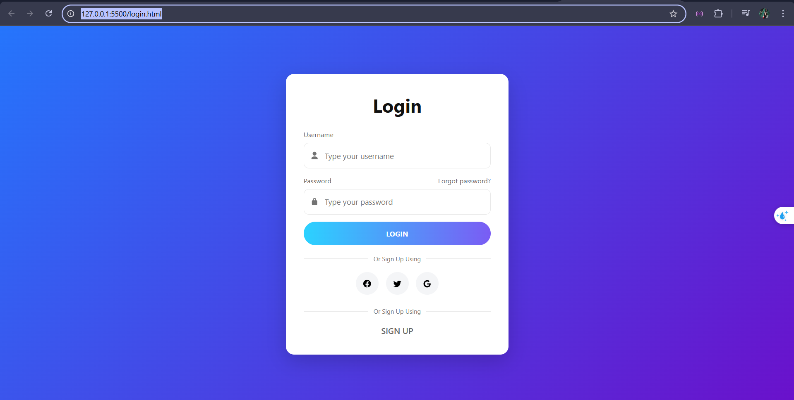
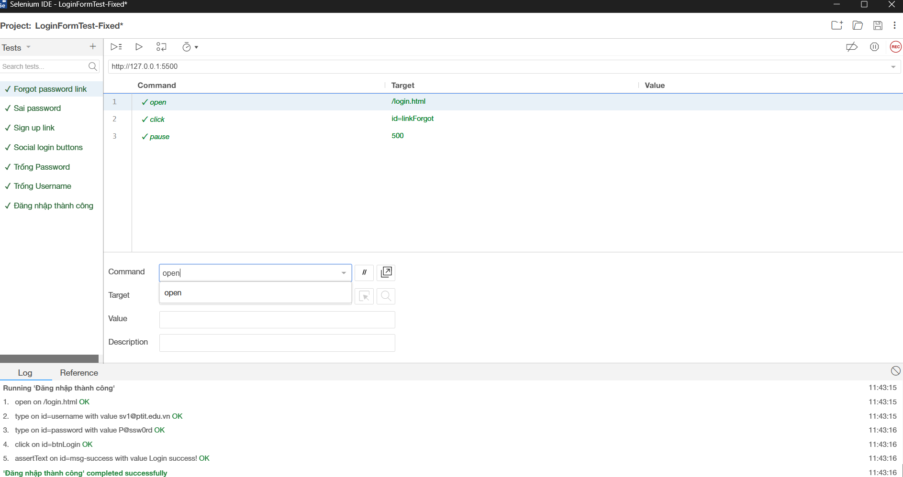

# 🚩 Lab 03 — Kiểm thử Form Đăng nhập (Selenium IDE)

# 🧩 Phân công vai trò nhóm

**Môn:** Nhập Môn Công Nghệ Phần Mềm  
**Đề tài:** F&B Mini Project – Quản lý & Xuất bản nội dung

---

## 👥 Thành viên nhóm

- **Nguyễn Lê Vân Anh** — *N23DCPT004*  
- **Vũ Hoàng Bảo Châu** — *N23DCPT008*  
- **Huỳnh Mai Ánh Dương** — *N23DCPT014*
  
---


## 📘 Ghi chú

Dự án mini được thực hiện theo quy trình SDLC (Waterfall – Simplified), gồm 3 thành viên với vai trò phân tách rõ ràng từ **phân tích**, **thiết kế** đến **lập trình và báo cáo tích hợp**.  
Tất cả các tệp UML, mã nguồn và tài liệu báo cáo được lưu trữ và quản lý trong cùng một repository GitHub để đảm bảo tính thống nhất và dễ dàng đánh giá.


---

## Mục tiêu

Thực hiện bộ test bằng **Selenium IDE** để kiểm chứng hoạt động của form đăng nhập (hai trường Username/Password, nút LOGIN, các link Forgot password? / SIGN UP và 3 nút đăng nhập social).

---

## Giao diện (tóm tắt)

Trang `login.html` bao gồm:

* Input **Username**
* Input **Password**
* Nút **LOGIN**
* Link **Forgot password?**
* Link **SIGN UP**
* Ba nút social: **Facebook, Twitter, Google**




---

## Test cases (tóm tắt)

1. **Login hợp lệ** — nhập tài khoản đúng → hiển thị thành công/đi tới Dashboard.
2. **Sai mật khẩu** — username đúng, password sai → show lỗi.
3. **Bỏ trống** — username hoặc password rỗng → show validation message.
4. **Forgot password** — link tồn tại và điều hướng đúng.
5. **SIGN UP** — link hiện ở vị trí thấp hơn form và click được.
6. **Social buttons** — có đủ 3 nút và phản hồi khi click (hoặc có attribute/ href).

---

## Tài khoản mẫu (dùng để test)

* Username: `sv_test@ptit.edu.vn`
* Password: `P@ssw0rd!`

*(Bạn có thể đổi thành account do nhóm tạo để tránh xung đột)*

---

## Hướng dẫn chạy (chi tiết từng bước)

### A. Chuẩn bị môi trường

1. Cài **VS Code** (nếu chưa có).
2. Cài extension **Live Server** trong VS Code.
3. Cài extension **Selenium IDE** cho Chrome hoặc Firefox.

### B. Mở trang test và lấy URL

1. Mở VS Code → `File > Open Folder...` → chọn thư mục project (chứa `login.html`).
2. Trên thanh Explorer, click phải vào `login.html` → `Open with Live Server`.
3. Trình duyệt sẽ mở trang, ví dụ: `http://127.0.0.1:5500/login.html` — **copy URL này**.

### C. Mở project test trong Selenium IDE

1. Mở extension **Selenium IDE** trên trình duyệt.
2. `File > Open Project` → chọn file `tests/login-tests.side` trong repo.
3. (Nếu file .side dùng đường dẫn tương đối) sửa step `open` trong mỗi test để thành URL copy từ Live Server.
4. Chạy `Run all tests` hoặc chạy từng test case.
5. Kiểm tra log để biết test pass / fail.

### D. Lưu ảnh chứng minh

* Sau khi chạy xong, chụp màn hình kết quả (Win: `Win+Shift+S`, macOS: `Cmd+Shift+4`).
* Lưu ảnh vào `tests/results/` rồi commit vào repo.


---

## Locators (gợi ý, ưu tiên ID > CSS)

* Username: `#username`
* Password: `#password`
* Login button: `button[type="submit"]` hoặc `#loginBtn`
* Forgot: `a.forgot-password` hoặc `xpath=//a[contains(.,'Forgot')]`
* Sign up: `a.signup`
* Facebook: `.social-facebook`
* Twitter: `.social-twitter`
* Google: `.social-google`

*(Nếu HTML khác, điều chỉnh selector tương ứng; ưu tiên dùng ID khi có.)*

---

## Ghi chú kỹ thuật & mẹo

* Nếu Selenium IDE không chạy tốt với `file://`, luôn dùng Live Server để phục vụ qua `http://`.
* Social login thường redirect ra provider — trong test chỉ cần verify **nút tồn tại** hoặc **href/data-provider**, không cần hoàn tất OAuth.
* Thêm `waitForElementPresent` trước các `click`/`assert` để tránh flaky tests.

---

## Xuất project và nộp bài

1. Trong Selenium IDE: `File > Save Project As` → chọn `tests/login-tests.side`.
2. Commit các file cần: `index.html`, `tests/login-tests.side`, `tests/results/*.png`, `README.md`.
3. Đẩy lên GitHub:

```bash
git add .
git commit -m "Lab03: Selenium IDE login tests"
git push origin main
```

4. Nộp link repo vào Google Classroom theo yêu cầu giảng viên.

---

## Checklist (xuống tay)

* [ ] Use Case diagram (đính kèm file hoặc ảnh)
* [ ] 6 test case đã implement và chạy được
* [ ] Locator rõ ràng, gọn (ưu tiên id/css)
* [ ] Ảnh screenshot kết quả (`tests/results/`)
* [ ] README hướng dẫn chạy (file này)
